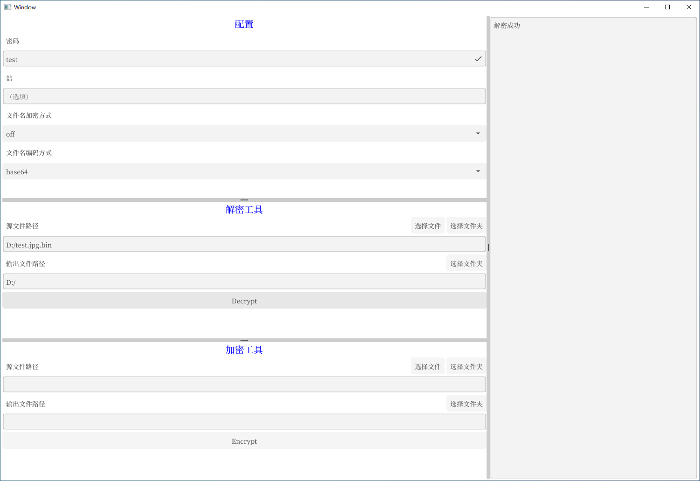

# rclone_crypt_desktop

使用 rclone 的 crypt，对文件进行加密、解密操作。

不需要安装 rclone，直接打开 .exe 就能使用。

适合在一个陌生的 PC 上遇到需要临时使用 rclone 的 crypt 的场景。

Encrypt or decrypt files with rclone crypt.

No need to install rclone, just open exe file.

It's suitable for processing files temporarily with rclone crypt on other people's PC.

### TODO

目前只支持处理单个文件，后续会支持处理给定的整个文件夹。

目前“文件名加密方式”和“文件名编码方式”不允许修改，后续测试后会支持修改。

